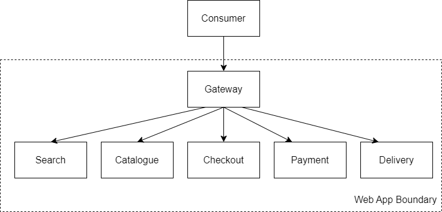

Exposing multiple services out of a container cluster can cause issues and complexity as you scale out. The Gateway pattern uses a proxy to manage several complexities and performance improvements.

The gateway pattern has three main facets. One gateway can host all three.

## When to Avoid

Don't use this pattern for small sites or even a handful of services; the overhead will be excessive.

## When to use

Use this pattern when you get into more than a handful of services with multiple teams working across them, with a moderate to large user base.

### Routing

One way to connect clients to services is direct. A direct client-to-microservice architecture provides the fewest moving parts. However, each service requires a TCP port to connect to. Each service uses a different port, which can prove complex to manage, especially for security-conscious customers who need to minimise exposure.

As more services start to be available, this becomes more complex. Which service do I connect to? How do I find the correct service? Using A/B testing exacerbates this even more!

Gateway Aggregation uses a proxy service in front of the microservice endpoints, redirecting pages and folders and hiding details of the production layout away from the outside world so that changes can be made and introduced.

[Gateway Routing](https://learn.microsoft.com/en-us/azure/architecture/patterns/gateway-routing)

### Offloading

A gateway allows multiple downstream services to share functionality or cross-cutting concerns. These can be things like:

* Authentication or authorisation
* SSL Offloading and certificate management
* Network Monitoring and throttling

Sometimes, these items might need special skills or segregation of responsibilities. In others, it is more effective to do these things once.

In either case, using a gateway to offload functionality mustn't create a dependency between the gateway and any downstream services, or it risks becoming a blocker to development.

[Gateway Offloading](https://learn.microsoft.com/en-us/azure/architecture/patterns/gateway-offloading)

### Aggregation

Gateway aggregation allows clients to minimise unnecessary chatter, especially valuable over the internet or mobile networks when communicating with a service.

Appropriately done, aggregation allows a server to manage client connections and improve performance.

[Gateway Aggregation](https://learn.microsoft.com/en-us/azure/architecture/patterns/gateway-aggregation)

## References
