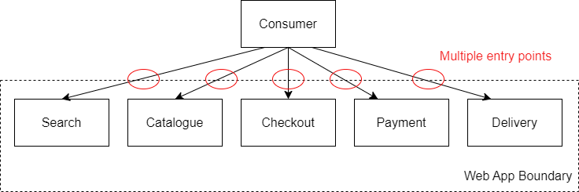

TODO: TL;DR

## Routing

One way to connect clients to services is direct. A direct client-to-microservice architecture provides the fewest moving parts. However, each service requires a TCP port to connect to. As each service is using a different port, this can start to prove difficult to manage, especially for security-conscious customers, who need to minimise exposure.

This can be even more complex when multiple services start to be available, which offer the same functionality. Which service do I connect to? How do I find the right service? It can be further worsened if different versions of the same service start to be in use, such as A/B testing.

Gateway Aggregation makes use of a proxy service, in-front of the microservice endpoints, redirecting pages and folders, hiding details of the production layout away from the outside world, so changes can be made and introduced in a lot simpler manner.

[Gateway Routing](https://learn.microsoft.com/en-us/azure/architecture/patterns/gateway-routing)

## Offloading

TODO: The gateway can offload shared functionality, such as authentication, TLS
certificates or issuing Authorisation tokens.

[Gateway Offloading](https://learn.microsoft.com/en-us/azure/architecture/patterns/gateway-offloading)

## Aggregation

TODO: The service all appears to come from a single domain, so much easier for a
client to manage connections to and from the service, improving security.

[Gateway Aggregation](https://learn.microsoft.com/en-us/azure/architecture/patterns/gateway-aggregation)

## References
