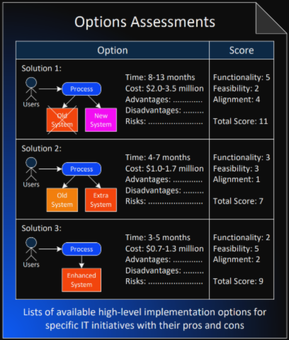

## Introduction

Architectural decision records (ADRs) capture a crucial technical decision, the context in which it was made, and the consequences of the decision. They are used to record the project’s architectural thinking and conclusions for further reference and to help new team members understand the rationale behind the design choices.

ADRs typically follow a template that includes the title, context, decision, status, consequences, and alternatives of the decision.

Use a folder or a wiki page to store ADRs. Somewhere close to the code repository and accessible to other stakeholders. You can create, review and update ADRs using tools like Azure DevOps.

## Process

Here is a process for creating Architectural Decision Records (ADRs) in Azure DevOps:

* Define a template for documenting ADRs that includes the following sections: title, context, decision, status, consequences, and alternatives¹.
* Use a folder in the Azure DevOps repository to store the ADRs. The folder name can be "adr" or "docs/adr" or something similar.
* Create a new work item in the backlog and mark it as technical for each architectural decision. Explain the decision and alternatives in the record and link to relevant resources.
* Assign the item to an engineering team based on their expertise and availability. The team should review the work item and possible solution options (3 is ideal) before deciding how to proceed and recording the decision in Markdown as a file. When writing the document, follow the template and store the output in Azure DevOps.
* Submit the ADR as a pull request and request feedback from the other teams and stakeholders. The pull request should also include any code changes that implement the decision.
* Review the feedback and update the ADR document and code changes accordingly. If there are any conflicts or disagreements, resolve them through discussion and consensus.
* Merge the pull request and mark the feature as done. The ADR document should be 'accepted' or 'rejected' depending on the review's outcome.
* Track the ADRs in a decision log that lists them by title, status, and date. The decision log can be a simple text file or a table on a Wiki page.
* Review the ADRs periodically and update them if necessary. If an ADR becomes obsolete or superseded by another decision, change its status accordingly and link to the new ADR.

This process can help you record your architectural and technical decisions for further reference and have the new team members up to date from day one.

A centralised Architecture team can review any ADRs made and either look to amend any of the Architecture Artefacts in response. It may be that several decisions cause a change in precedence, which requires adjusting principles or technology guidelines.

Remember, the aim of an architecture practice is to:

1. Simplify
2. De-risk
3. **Not** dictate solution

To that end, the architecture needs to review and adapt to ensure it doesn't become stale.

## Providing short, contextual decisions

Using a sustainable format is essential to keep decisions documentation light and relevant. Here are some examples:

### Y-Statements

[(Wh)Y statements](https://medium.com/olzzio/y-statements-10eb07b5a177)
(Borrowed from Olaf Zimmerman, an Architect at IBM.)

> #### Worked Example
>
> *In the context* of the business multi utility quoting tool,
>
> *Facing the need to* provide accurate and competitive quotes for gas, electricity and water services,
>
> *We decided for* the Multi Utility Service Provider (MUSP) pattern.
>
> *And against* Single Utility Service Provider (SUSP) or Multiple Utility Service Providers (MUSPs).
>
> *To achieve* cost savings, convenience and efficiency for our customers,
> *Accepting that* a MUSP requires more integration and coordination with different utility suppliers.

The format of a Y-Statement creates six phrases in three sections:

> 1. In the Context of... *(Name of the solution)*
> 2. Facing the need to... *(Critical challenge)*
> 3. We decided for... *(The winning solution)*
> 4. And against... *(The other considered solutions)*
> 5. To Acheive... *(The main outcome)*
> 6. Accepting that... *(Any Consequences)*
> 7. *Because... (Optional explaination of reasoning)*

Each outlines a single critical point about the decision. The context and need, the 'winner' and other options considered, the expected outcome and consequences, and optional reasoning if more words are needed.

> Loads of examples here: [architecture-decision-record/examples](https://github.com/joelparkerhenderson/architecture-decision-record/tree/main/examples) Accessed: 31 May 2023.

### Architectural Haiku

Another approach is the [Architectural Haiku](https://www.georgefairbanks.com/blog/comparch-wicsa-2011-panel-discussion-and-haiku-tutorial/), coined by George Fairbanks in 2011.

The Architectural Haiku is a single 'slide' of information explaining a critical decision and its rationale and context. Using a 'slide' as the size of the decision artefact limits its length and duration to one page and around 3-4 minutes.

> "If I had more time, I would have written a shorter letter" - Blaise Pascal, 1657

As with any framework or method, follow the idiom 'If in doubt, leave it out'.

## Version Control

Version Control for your ADRs is essential so you know when they change, who changed them, and who approved them. Using your GIT repo for this is probably the most straightforward idea, as it can do these things effortlessly with the files.

## In Practice

Some great ADR tools are around, including ones that use a CLI or DevOps. In this instance, the aim is to use a work item in DevOps linked to a file containing the ADR text, written using Markdown. It can be changed if necessary.

Write a Y-Statement explaining the decision. The discussion is not essential, but the context and the discarded alternatives are.
For a more significant decision, it may be helpful to produce an Options assessment:

Svyatoslav Kotusev, 2013, [Enterprise Architecture on a Page v2.0](http://eaonapage.com/Enterprise%20Architecture%20on%20a%20Page%20(v2.0).pdf.)


The list of ADRs is easy to find and query. Anyone can look at the recent ADRs. The architects will regularly review ADRs themselves and look to adapt the architecture as necessary, either creating or updating principles or NFRs to reduce the number of decisions which need to be made and thus recorded.

So, grab the template below, use the text in a file or work item and record those technical decisions!

## Template

```Markdown
> 1. In the context of...
> 2. Facing the need to...
> 3. We decided for...
> 4. And against...
> 5. To acheive...
> 6. Accepting that...
```

## References

1. [Architecture Decision Records (ADR) With Azure DevOps.](https://medium.com/nerd-for-tech/architecture-decision-records-adr-with-azure-devops-3f0c9edeb85b) Accessed 31/05/2023.
2. [joelparkerhenderson/architecture-decision-record - GitHub.](https://github.com/joelparkerhenderson/architecture-decision-record) Accessed 31/05/2023.
3. [AWS Publishes Guide to Architecture Decision Records - InfoQ.](https://www.infoq.com/news/2022/06/aws-adr-guide/) Accessed 31/05/2023.
4. [Getting Started with Architecture Decision Records - SlideShare.](https://www.slideshare.net/mkeeling5000/getting-started-with-architecture-decision-records) Accessed 31/05/2023.
5. [Architectural decision guides - Cloud Adoption Framework.](https://learn.microsoft.com/en-us/azure/cloud-adoption-framework/decision-guides/) Accessed 31/05/2023.

## Additional Resources

* [ADR GitHub Organisation / GitHub](https://adr.github.io/)
* [ADR with DevOps | Medium](https://medium.com/nerd-for-tech/architecture-decision-records-adr-with-azure-devops-3f0c9edeb85b)
* [ADR Examples \ GitHub](https://github.com/joelparkerhenderson/architecture-decision-record/tree/main/examples)
* [Y-Statements - Medium](https://medium.com/olzzio/y-statements-10eb07b5a177)
