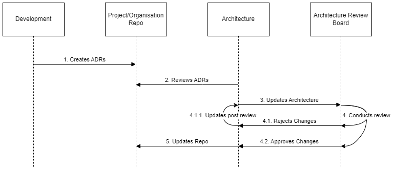

Software and systems architects provide guidance and governance of a technology organization by, amongst other things, modeling the organization, its departments, capabilities, and processes and then mapping technology into them to ensure that the business has a somewhat optimized set environment, which can adapt to its needs and isn't onerous to look after.

Traditional approaches to this take time and go against the agile philosophy to avoid Big Up Front Design BUFD. How best to support developers in an agile world?

The common concept in an agile development organization is 'Emergent Architecture.' But what does that mean? You follow a model more akin to evolution than planning and interfere if you see things dangerous to the organization. You use history as a lesson, but accept what happened and don't try to remove it.

## In theory

As development teams self-organize, the architecture role is to support decision-making and ensure good decisions thrive while poor choices don't.

This concept's core work item is the ADR or Architectural Decision Record. Whenever the team decides how development will proceed, they write it down in their work system. ADRs are covered in more detail [here](xref:architecture-decision-records).

The architecture team review and steer ADRs. ADRs are like the tweet format of designs; they encompass small decisions and choices with just enough context and reasoning to explain to a new starter why something happened. A significant benefit is that they can all be queried and exported and used to describe the project thinking over time and why the team made confident choices. The ADR list acts as a log, which someone could examine to trace the project's decisions.

The architecture practice reviews the ADRs and looks for trends and patterns. As certain things come to the fore, the architects write new [principles](xref:principles), [patterns](xref:patterns), and [NFRs](xref:nfrs) approved by the ARB to help the teams make future decisions.

The architect group will propose amendments to the organization's architecture to the ARB, which may require approval, depending on the size and scope of the new principles.

Changes in architecture guidance are applied retrospectively but may result in the creation of new technical debt items. Similar to how the law or regulation works.

## In Practice

It is up to the development team to decide how to solve problems based on the environment. The environment includes:

* Existing systems
* People & Culture
* Existing technology
* Existing projects

Most people try to make good decisions. Usually, bad decisions are the result of poor communication or poor information. The architecture practice must create meaningful decisions and knowledge and help educate people so the teams can make better decisions.

By using a feedback loop, from the decisions the teams make and accepting that these won't all be good, we can adjust the team's behavior through education, exposure, and experience.

## Anti-patterns of architecture

Despite our best efforts, sometimes architects don't get things right. We're sorry, but we're also human, like everyone else. Here's a list of problem archetypes of architects, mainly for fun and giggles.

### Ivory Tower

Too removed from the business of the organization. They watch from on high and make proclamations while unaware of the plight of the people on the ground. This type of architect seems to create a lot of work, but it's detached from the reality and culture of the business.

### In the trenches

Too focused on their previous role, trench warriors refuse to give up their tactical responsibility and involvement and don't have time or focus for strategy. Sometimes this is because of the current state of the organization. Sometimes it's because they don't have the exposure to build a picture of a real strategy for the business.

### Overly Academic

Studious and thorough, working through frameworks and quoting luminaries, the academic cannot effectively translate these theories into practical output for the organization. They talk about possibilities, gold standards, and best practices and sometimes focus on the areas of frameworks which aren't implemented or fully used.

Knowledge and understanding of frameworks are essential, but frameworks are collections of methods that can help. Using strategies to address issues in the business is good sense. Using techniques to address symptomless 'problems' will make no friends.

### Too technical

Often recruited from technical areas, such as IT Operations, the too-technical architect hasn't learned to temper their language to a broader audience. Using too much technical language conversationally can result in getting typecast as another 'techie,' being sidelined from honest discussions and gaining the trust of other parts of the business.

The technical skills are a real boon, though, and help when working with the more technical aspects of the organization.

### Over-specialized

An architect should have a wide variety of skills and a broad understanding of most areas of their domain. If the field is too large, then specialism is a natural part of that, but an architect should work across as much of the environment as necessary, learning what they can of each part of the organization.

If an architect only understands IT, they won't be able to effectively talk to Finance Partners or Legal about changes, budgets, or compliance. They may struggle to explain hosting concerns if they only know operations and not development.

Architects often have specialisms, but typically these start to be relinquished after they start becoming architects, moving away from specifics and into broader concepts, so they can better help explain the organization's mechanics.

## Further Reading

## References
