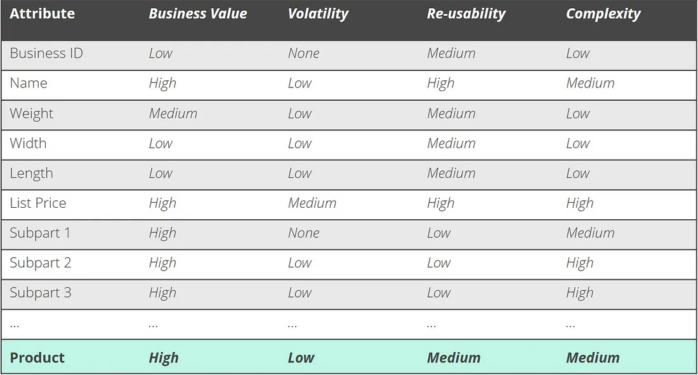

## Introduction

Business Data management is the organisation of people, processes and technologies to create and maintain a reliable data environment for business.

>[The Tale of Two Customers (James B & Bing AI, 2023)](xref:a-tale-of-two-customers) shows how well-understood, linked information can help improve customer experience and business success. It talks about two experiences of customer service, one positive and one negative, through the eyes of Alice (who has a good experience) and Bob (who has a bad one).
>
>I think we've all been Alice or Bob at some point, and it's likely that when we felt like Alice, we used the company again. And when we felt like Bob, we avoided them and repeatedly told our friends and family about the poor experience.

## Business Data

Business Data is a broad term; you could ask several people and never get a consistent answer.

This article refers to 'the critical information required to run the organisation' as 'Business Data'. Each department may have its own. Acquisitions will have their own. Partners will have their own.

> You have probably heard the term 'Master Data Management'. In this article we'll eschew the word as its not in keeping with culture. Links to outside sources will still use that term as its been active for at least 15 years.

Business Data management is the organisation of people, processes and technologies to create and maintain data in a way which is:

* Authoritative
* Reliable
* Sustainable
* Accurate
* Secure

Great if you are lucky enough to have a single system which everyone uses to track orders, shipments, payments and work items. Your data is already probably mastered and accurate. A design like this is a business's 'gold standard' of information management.

But it's rarely found in any but the smallest or largest organisations. Small organisations cope with limited systems. The larger ones invest heavily in creating designs that match their processes and allow this interaction.

For everyone else, we need to understand and link data to simplify our work and limit the expense of supporting our customers while offering them a great experience they want to return to.

Easy access to a single record system eases and supports the business. Each area may use a different database system, but as long as the resulting view is consistent, this will not harm the organisation.

Ideally, we want to try and limit the number of systems customer-facing colleagues are using. They should be able to work in one place to ease training and stress.

Managing this data is done by understanding how information flows through an organisation and creating an authoritative model to keep every other system up to date.

This single source can be decentralised, consolidated or any other shape you can imagine as long as the data source and the data relationships are understood, and the outcome results in an ability to see the whole picture about a customer, reseller, product or other important entity.

## Data Strategy

A data strategy sets the tone for the project, outlining why its important and what the expectations are for it, and how it will be achieved. It also includes how the organisation will confront its opposition.

>[McKinsey cites modern data architecture](https://www.mckinsey.com/capabilities/mckinsey-digital/our-insights/how-to-build-a-data-architecture-to-drive-innovation-today-and-tomorrow) as a critical business driver, but it can be one of the most expensive projects a company can take on. A Strategy to adopt the right data capability for the organisation's growth and maturity is essential.

Here is an example:

> At <...>, our mission is to simplify our customer's needs. We need to understand their use of and be able to track how we can align their use.
>
> Our data strategy reflects our business goals:
>
> * Provide a coherent, connected view of the customer and their use of our products, so they can quickly see how their usage varies and make educated decisions. Providing this joined-up view allows our initiatives to succeed and scale
> * To support <...> to get th e correct information quickly and easily, so we can continue to deliver excellent customer service.
> * To support, and not detract from, our main value proposition by offering a lightweight solution which aligns with our values and principles
> * This ability to provide a sensible, joined-up story allows us to out-perform our competitors and exceed our customers expectations. This allows us to effectively...
>
>The Data team will support <...> to achieve these goals:
>
> * By identifying and managing our Core Business Data which is required to create integrated customer experiences
> * Through maintaining authoritative sources, which the broader organisation can easily access
> * Ensuring our data stewardship is fit for purpose as our regulated footprint grows
> * By providing a lightweight service which delivers the necessary functionality in a cost-effective manner
>
>For <...>, Data Management is a critical enabler to our business goals.
>
> * Allows us to create a single view of ...
> * Enable us to analyse ....
> * Integrate new systems, products, etc...

This strategy outlines how to achieve this and gain short-term benefits incrementally. The outcomes align with the organisation's goals and explain how Data Management is necessary to deliver those goals.

The rest of this article will describe the project necessary to create such a hub and what types of tools will be required.

## Method

A Data Management project involves several stages. Not all are essential, but some have to come first.

> Schedlbauer, M. (2019) Master Data Management, shipzero. [Medium](https://medium.com/appanion/10-steps-towards-a-successful-master-data-management-project-1322e20d2241).

## 1. Goal - Define Business Outcomes

An important step. Things only happen when there is a tangible goal for the business. Data Management drives two main types of value streams:

1. Data Management drives a short-term return on its investment by managing inconsistencies, improving analysis and reducing the effort to visualise and analyse data. It boosts responses to customers and partners.
2. A longer-term return is the capability to model and simulate how changes affect business performance. Data Management allows business modelling and testing, which can make analytics a strategic investment. It supports acquisition and integration by ensuring new systems adapt to existing data.

It is vital to maintain both the vision (Analytics as a strategic enabler) and the short-term gains (we can show value in the short term by doing -something-) when explaining the importance of Data Management and a data strategy.

## 2. Identification

### Identify Core Business Data

At the start of any project, identify the relevant business data for that project, not all the business data you may ever need, and certainly not all the data you have.

The following characteristics help identify Core Business Data:

* High Business Value
* Low volatility
* Complex
* Reusable

Core Business data is only the high-value, complex, reusable entities with low volatility, such as:

* Customers
  * CustomerAccounts
  * CustomerSites
  * CustomerCredit
* Products
  * Prices
* Contracts
* Employee
* Location
* Vendor
* Supplier
* Invoice

Critical data is not necessarily core business data. A training video can be vital for compliance, but only in that context. As it is not widely reusable, it wouldn't be considered Core Business Data, but it is still important.

Core Business Data does not, and should not, include transaction data. That stuff is too fast-moving to manage using this pattern. A data warehouse or an event stream is a better way to manage analytics for transactional data. It could link to the transactional view or the analytical aggregates of the transactions.

From a data warehouse point of view, Core Business Data fields are critical dimensions which change slowly, but not the facts about those dimensions.

> Schedlbauer, M. (2019) Master Data Management, shipzero. [Medium](https://medium.com/appanion/10-steps-towards-a-successful-master-data-management-project-1322e20d2241).

 Once we know what they are, we can understand and expose the proper entities and their fields from the right places.

### Identify & Evaluate Data Sources

Where do we get this data from? Where was it created or first used? How can we trust that it is correct? These are all critical questions to ask on our journey. The next step is to identify where our Core Business Data comes from and whether that is a system of record.

Identifying the right place to collect different data items is crucial as it lets us integrate or populate data as soon as possible in the lifecycle. Having a clear lineage for each entity increases the ability to diagnose issues with data and ensures data is more accurate and trustworthy.

Following the data lifecycle in an organisation makes the process less invasive or disruptive. Which department/system gets to the entity first? For a new product, it is likely to be Product Management. Sales probably identify a Customer first. Using these 'natural' systems as the system of record and the source of information ensures the organisation captures data soon and remains current.

Evaluate whether these systems have available interfaces to export data, ideally, modern interfaces that drive events.

TODO: List some example sources for core business data

If possible, using webhooks or an event model means we can quickly raise events when something changes, and each interested system can update its copy of any information.

## 3. Analysis

### Metadata

Defining and managing metadata for a business would be an entire article or more on its own. Detailed data about your data, who created it, where they created it, when they made it and who last edited it can all add value to a business by increasing understanding of critical entities.

Different areas of the business have other processes and different names for things. Metadata requires analysis to check for consistency across systems. Different teams and systems likely use other terms or values for the same things. It's important to align these things to create a shared language for the organisation.

The easiest solution is to add all the different, relevant metadata to the Master Data entity so that other systems can access the metadata. Then train departmental leaders in the correct terms. To allow a colleague to understand who last worked with an entity, what happened to the entity and whether it is live or stale, Metadata should include Comments, Versions, Updates and Editors.

Consider what Core Business data Metadata is relevant outside of the source system. Sometimes, there is no actual use outside the source. If in doubt, leave it out!

### Data Lifecycles

Who:

* Creates the data
* Updates the data
* Views the data
* Deletes the data

Define these items for each Core Data domain. These lifecycles define where something is created and edited. At different steps in the lifecycle, other systems are 'the' primary source, and this can vary over time.

A 'multi-master' model is too complex to maintain, so avoid it.

### Worked examples

1. 'Customer' is created in 'System' when 'Event' By 'Persona'
2. 'Customer' is updated in 'System' when 'signed up' to 'Persona'
3. 'Customer' is viewed in 'System' when '...' by 'persona'
4. 'Customer' is viewed in 'System' when '...' by '...'
5. 'Customer' is deleted in 'System' when '...' by '...'

## 4. Involvement - Appoint Data Stewards

Have two people for each 'domain' in the department who create and use that entity the most act as stewards for it. The two people should be:

* Business, from the department that makes or uses the core entity the most.
* 'Technical', which *could* be from the data team if there's no one more local.

They need a working relationship for regular changes/updates and can make local decisions if the impact is non-breaking or within budget.

## 5. Infrastructure

Now we look at tools and capabilities and decide what we have, what we need and what we would like. Based on research into reference models, the following characteristics are essential to add to a company's data tooling:

Must-Haves

* Data Governance, such as lineage, catalogue and provenance.
* Data Factories, which process and ingest data to operational services.
* Data APIs, which support OpenAPI specifications and allow systems to communicate and interrogate each other
* Data Marts; analytical 'shop-fronts' which store processed data for known use cases.

As an organisation, you need to decide whether a 'hypermarket', or little specialist shops is the right approach. One stop can be good, but specialists might fit. It could also be a blend, where your business has some areas that require a more specialist shop than others.

Nice-to-Haves

* Fast data flows. Process feeds of information close to real-time.
* Discovery and Research areas. Places for data science to occur, allowing organisational learning.

### Architecture

A reference architecture is a great guide to have. It shows you all the important points you could visit, but you don't have to visit any of them unless they solve a problem for your business.

Don't reinvent the wheel. Choose an architecture which is closest to your identified needs and adapt that.

* [How to Build a Data Architecture to drive innovation, McKinsey](https://www.mckinsey.com/capabilities/mckinsey-digital/our-insights/how-to-build-a-data-architecture-to-drive-innovation-today-and-tomorrow)
* [Building a Data Hub, Ticking Trend](https://www.tickingtrend.com/articles/building-a-data-hub#:~:text=Building%20a%20Data%20Hub%201%20Step%201%3A%20Define,Data%20Governance%20...%207%20Step%207%3A%20Data%20Analytics)
* [Data Hubs - What's Next in Data Architecture, Eckerson](https://www.eckerson.com/articles/data-hubs-what-s-next-in-data-architecture)

A data hub architecture separates the management of core business data from other concerns, such as analytics. As a collection of web services, it follows the principles and standards <...> adheres to, including:

* Multi-cloud capable
* Scalable
* Proportionate

A data hub also enables [data mesh](https://learn.microsoft.com/en-us/azure/cloud-adoption-framework/scenarios/cloud-scale-analytics/architectures/what-is-data-mesh) or [polyglot persistence](https://techcommunity.microsoft.com/t5/data-architecture-blog/polyglot-persistence-with-azure-data-services/ba-p/1514912#:~:text=Polyglot%20Persistence%20is%20the%20concept%20of%20using%20different,support%20all%20possible%20data%20types%20and%20its%20usages.) implementation later.

### Data Model

Pick an understandable data model. Ideally, use a reference model rather than invent from scratch, but don't choose one that is too big or fancy. Extensibility is essential, as is the scale of the project.

Microsoft provides the following Common Data Model. While they interchange the term with the physical infrastructure underlying their Dynamics 265 platform, the model is valid and provides a cross-industry organisational data model.

This overview of familiar entities can be a good reference model to help plan and consider the information required to keep business moving.

>[Common Data Model, Microsoft.com](https://learn.microsoft.com/en-us/azure/cloud-adoption-framework/scenarios/cloud-scale-analytics/architectures/common-industry-data-models)

### Toolset

>Microsoft uses the following overview of Azure services as a model for the types of tools needed.
>
>[Cloud Scale Analytics](https://learn.microsoft.com/en-us/azure/cloud-adoption-framework/scenarios/cloud-scale-analytics/architectures/overview-architectures)
>
>Review these as options to help feed organisational demand for data.

### Evaluate & Plan Changes

How will you add these to the existing estate?

## 6. Prototypes and Testing

By this, I mean testing the process of MDM as a business enabler. It must work, but it must add value. Work with the stewards to understand pains, shortcomings, or ways to add value.

* Create a Hypothesis around how data will improve a process or add value.
* Test it.
* Keep it small and achievable, and deliver some results.
* something-something
* Grow in confidence.
* Profit.
* Repeat.

'Something-something' would be a data project, which builds from your knowledge of the environment you work in and the technology landscape you have built so far. Business Data Management is a great place to start aligning your data across systems, but you can start anywhere.

>## Maturity Model
>
>One way to assess the capability of an organisation is by looking at a Maturity model. Here is an example from the Uk Government of a Data Maturity model aimed at UK Government departments, which encourages:
>
>* Documentation
>* Data to be Open within the government community
>* Secured and authenticated
>* Use of Open Standards
>
>These traits are desirable for most organisations, as integrating data easily across your enterprise is a strategic strength.
>
>* Documentation
>* APIs
>* OAuth
>
>There are three maturity levels used within the three areas above.
>
>### Documentation
>
>Documentation increases the collective knowledge of everyone that you work with. When it becomes the norm on your team to share information, you’ll benefit from increased transparency and a culture that’s more collaborative and strategic. Documentation encourages knowledge sharing, which empowers your team to understand how processes work and what finished projects typically look like.
>
>1. Your systems are not documented
>2. Your systems are all documented
>3. Documentation is automated and self-updating
>
>### APIs
>
>APIs (Application Programming Interfaces) are important for businesses because they enable applications, devices, and data to share information, interact, and take on tasks together. APIs also create greater shared awareness and confidence in the data models and structure of the business. APIs can help businesses sell their products and services online or extend their applications by adding more codes. Effectively using APIs can reduce operational or technology costs by simplifying and accelerating development. APIs are also essential to building business intelligence because they provide access to your data, allowing others to build applications that you could never have foreseen.
>
>1. Most of your systems do not support APIs
>2. The majority of systems support APIs
>3. APIs are published to a catalogue with documentation
>
>### OAuth
>
>OAuth (short for “Open Authorization”) is an open standard for access delegation. It is commonly used as a way for internet users to grant websites or applications access to their information on other websites but without giving them the passwords. OAuth is an authorization framework that enables third-party applications to obtain limited access to an HTTP service, either on behalf of a resource owner by orchestrating an approval interaction between the resource owner and the HTTP service, or by allowing the third-party application to obtain access on its own behalf.
>
>1. The Open Authentication (OAuth) protocol is available for use.
>2. OAuth is available to your partners and customers
>3. OAuth is available to people who are external to the organisation

Taken together these three areas give some context around how to measure the data maturity of different areas or applications within the business.

## Conclusion

The article explains that Business Data Management is the process of organising and collating data to create and maintain a reliable data environment for business. It highlights the importance of understanding how information flows through an organisation and creating an authoritative model to keep every other system up to date. The article also talks about how well-understood, linked information can help improve customer experience and business success. Finally, it outlines the steps involved in a Data Management project which includes identifying Core Business Data, evaluating data sources and creating a data strategy that aligns with the organisation’s goals.

## References

1. [Schedlbauer, M. (2019). Master Data Management. Online.](https://medium.com/appanion/10-steps-towards-a-successful-master-data-management-project-1322e20d2241)
2. [Develop your data and APIs using a reference architecture GOV.UK.](https://www.gov.uk/guidance/develop-your-data-and-apis-using-a-reference-architecture)
