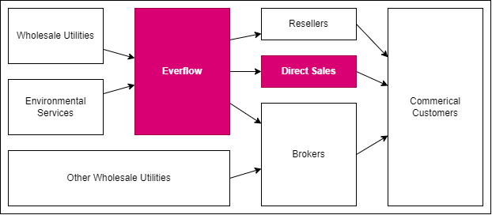
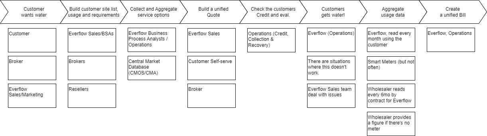
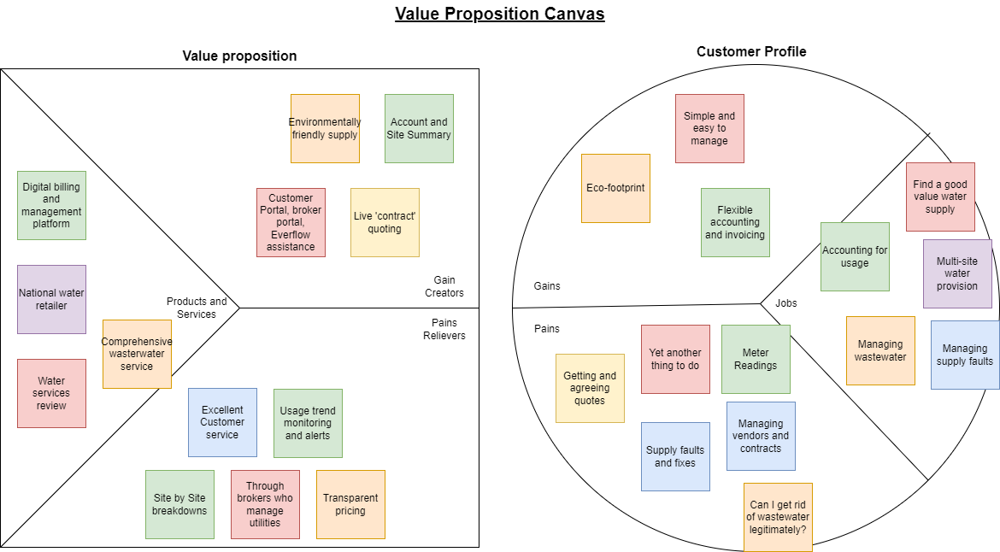
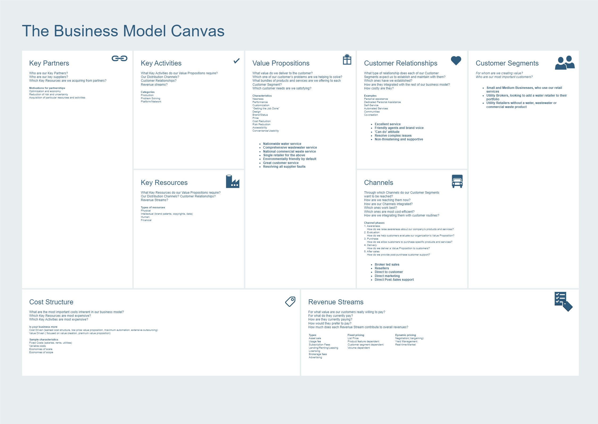
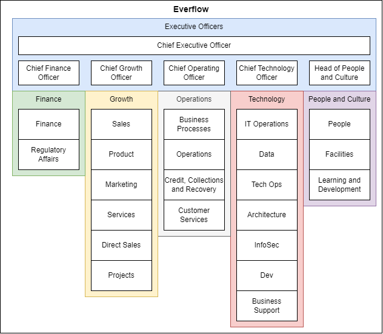

## Strategy

Everflow's business is to sell commercial utilities through brokers to SME clients. While these services are low margin, multi-utility brokers see them as a defensive sale to prevent other brokers or retailers from accessing the client.

Everflow will look to its ease of use, customer service, and environmental credentials to differentiate itself while remaining price comparable. To achieve this, Everflow will need to rely on effective processes and automation to keep the cost of service low.

Everflow is creating a positive, disruptive image by keeping its retail pricing transparent and ensuring customers can see the wholesale cost, fluctuations, and a fixed retail uplift.

Growth and performance will be essential to maintain a positive brand and image, enforcing the position of a challenger and an innovator.

To support its position as a leader in the field, Everflow actively participates in regulatory advisory groups for the markets in which it operates.

In time, Everflow will look to further differentiate and expand by offering additional utility services through the same multi-utility quoting and billing platform.

## Enterprise Context

Explaining how Everflow interacts with other organizations as part of their joint enterprise.

Everflow aggregates regional water authorities to SME customers in England and Scotland and then integrates quoting and billing. The ideal customer has sites across several counties and water authorities.

Everflow uses three channels to market:

* 10% Direct Sales
* 90% Broker Sales

Some % of the Brokers are called brokers but use a white-labeled platform or an API. They are resellers and don't sell Eveflow; more use Everflow to provide services.

A key advantage of using brokers is that Everflow was able to get traction by being added alongside a higher-value service. Many Brokers use Everflow to easily offer water alongside more lucrative Energy utilities without handling the complex and low margin leg-work involved.

## Business Value Stream

Shows how Everflow creates value through its primary water business

Everflow creates value by aggregating data about water suppliers and helping a customer to select from all the possible options by providing guided recommendations. In itself, this is pretty simple. However, Everflow can do this for every site in your business, a significant and complex exercise for businesses with several sites.

The water and wastewater markets have become increasingly deregulated, creating many choices and complexity. This niche is where Everflow works.

Everflow sells through 3 separate channels

1. Direct Sales
2. Broker Sales
3. Resellers, who sell the service as their own.

Everflows primary product is the Water, Wastewater, and Commercial Waste Services supply contract. This contract is a complex set of clauses around providing these utility services at 1+ commercial sites.

The value is in the contextual jobs of the task than in the task itself. Commercial water is not too complex until you have a lot of sites. Then, managing regional providers becomes a challenge. Everflow removes the contextual jobs around 'provide water' and 'remove wastewater' from the customer.

## Value Proposition

The value proposition is vital to product development and understanding how a value stream works. It is not a typical part of enterprise architecture. Still, the author believes it is a powerful way to ensure staff understands how your company makes money, what clients chose your company for, and, thus, what is essential to your brand and continued success.

A value proposition canvas explains the customer's Jobs, Pains, and Gains and how your company or products address them.

A value proposition canvas is a tool for workshopping the value proposition of a product or service. This draft canvas explains how Everflow differentiates its services, how Everflow addresses Customer pains, and how Everflow provides extra value-added gains.

The canvas reads right to left, and the coloured cards link, to highlight the Job a customer has to do, the Pains they experience, and the Gains they would like.

The left-hand box then outlines how Everflow's Products and Services address those Pains and create gains.

> For more information on the Value Proposition Canvas, look here: [Strategyzer.com, Value Proposition Canvas](https://www.strategyzer.com/business-model-canvas/value-propositions)

Based on this canvas, we can see that Water is a must-have for every company, just as it is for every person. But it isn't easy to differentiate as it is such a ubiquitous commodity. The most significant areas of differentiation are:

* Simplifying the service
* Removing pains and hassles
* Relieving environmental guilt.

An example value proposition, taken from the above, could be:

>Simple, clean utilities.

or

> Water. Without the worries.

The Strategyzer example uses a different template:

> Our *utility platform*
>
> helps *brokers and customers*
>
> who want to *quickly and efficiently arrange a utility supply*
>
> by *allowing a live quote to become a contract*
>
> and *unified into a single transaction and bill, with other utilities*
>
> unlike *several of our competitors, who make customers arrange site by site*

This format can help articulate the finer points of the value proposition. Particularly the strategic 'unlike' element allows you to address a competitive differentiation directly.

## Business Model

TODO

## Capabilities

TODO

## Organisation Chart

Organisational charts change over time. It's better to work from a value stream and capabilities and then map them to the chart, as the chart can keep changing.

## Capabilities, mapped to the Organisation
