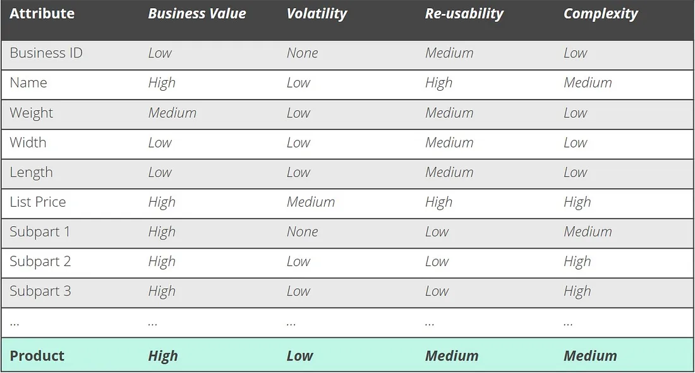

## A Tale of Two Customers - Story

Alice and Bob are both customers of XYZ, a large online retailer that sells electronic products. They both ordered a new laptop from XYZ’s website and received a confirmation email with their order details and invoice.

Alice was happy with her purchase and enjoyed using her new laptop for work and entertainment. However, one day, she noticed the computer was overheating and making strange noises. She contacted XYZ’s customer support to see if they could help her.

She called the toll-free number on the website, and a friendly voice greeted her, “Hello, this is XYZ customer support. How may I help you today?”

“Hi, I have a problem with my laptop that I bought from your website. It’s overheating and making weird noises.”

“I’m sorry to hear that. Can you please tell me your name and order number?”

“Sure, my name is Alice Smith, and my order number is 123456789.”

“Thank you, Alice. I see your order here. You bought a Dell Inspiron 15 3000 Series Laptop on June 1st, right?”

“Yes, that’s correct.”

“Okay, let me check the warranty status of your laptop. It looks like it’s still under warranty. You can return it for a replacement or refund. Which option would you prefer?”

“I think I’d like a replacement, please.”

“Alright, no problem. I’ll send you an email with the instructions on how to return your laptop and get a new one. Is there anything else I can do for you today?”

“No, that’s all. I appreciate your help.”

“You’re very welcome, Alice. Thank you for choosing XYZ. Have a nice day.”

Alice hung up the phone and checked her email. She received a message from XYZ with a prepaid shipping label and a tracking number for her replacement laptop. She was impressed by how easy and fast the process was and how consistent the data was between sales and customer support.

Bob was also happy with his purchase and enjoyed using his new laptop for work and entertainment. However, one day, he noticed the computer was malfunctioning, and the battery life was meagre. He contacted XYZ’s customer support to see if they could help him.

He called the toll-free number on the website and was greeted by a robotic voice. “Welcome to XYZ customer support. Please say or enter your order number.”

Bob looked at his confirmation email and said his order number.

“I’m sorry, I missed that. Please say or enter your order number.”

Bob repeated his order number.

“I’m sorry, I still didn’t catch that. Please say or enter your order number.”

Bob entered his order number on his phone keypad.

“Thank you. Please hold while we transfer you to an available agent.”

Bob waited for several minutes while listening to annoying music.

“Hello, this is XYZ customer support. How may I help you today?”

“Hi, I have a problem with my laptop that I bought from your website. It’s not charging properly, and the battery life is poor.”

“I’m sorry to hear that. Can you please tell me your name and email address?”

“Sure, my name is Bob Jones, and my email address is bob.jones@email.com.”

“Thank you, Bob. I don’t see any orders under your name or email address. Are you sure you bought it from our website?”

“Yes, I’m sure. I have the confirmation email right here.”

“Can you please read me the order number?”

Bob reread his order number.

“I’m sorry, but that order number doesn’t match our records. Are you sure it’s correct?”

“Yes, it’s correct. It’s the same one I entered before.”

“Well, I don’t know what to tell you, Bob. There must be some mistake in our system. Maybe you bought it from another website or used a different email address.”

“No, I didn’t. I bought it from your website and used this email address.”

“I’m sorry, but I can’t help you with your issue without a valid order number. Is there anything else I can do for you today?”

“No, there’s nothing else you can do for me except fix your data management system!”

Bob hung up the phone in frustration and rechecked his email. He saw that he received a message from XYZ with an advertisement for a new laptop model. He was outraged by how poor and slow the service was and how inconsistent the data was between sales and customer support.

The End

## Introduction

The Tale of Two Customers (Bing AI, 2023) above shows how well-understood and linked Master Data can help improve customer experience and business success. I think we've all been Alice or Bob at some point, and it's likely that when we felt like Alice, we used the company again. And when we felt like Bob, we avoided them and repeatedly told our friends and family about the poor experience.

## Master Data

Master Data is a confusing term. 

This article refers to 'the critical information required to run the organisation' as 'Master Data'. Each department may have its own. Acquisitions will have their own. Partners will have their own.

How do we ensure our Enterprise has an up-to-date, single view of the customer?

**By Managing our Master Data**.

Master Data management (MDM) is the organisation of people, processes and technologies to create and maintain data in a way which is:

* Authoritative
* Reliable
* Sustainable
* Accurate
* Secure

Great if you are lucky enough to have a single system which everyone uses to track orders, shipments, payments and work items. Your data is already probably mastered and accurate. A design like this is a business's 'gold standard' of information management.

But it's rarely found in any but the smallest or largest organisations. Small organisations cope with limited systems. The larger ones invest heavily in creating designs that match their processes and allow this interaction.

For everyone else, we need to understand and link data to simplify our work and limit the expense of supporting our customers while offering them a great experience they want to return to.

Easy access to a single record system eases and supports the business. Each area may use a different database system, but as long as the resulting view is consistent, this will not harm the organisation.

Ideally we want to try and limit the number of systems customer-facing colleagues are using. They should be able to work in one place to ease training and stress.

MDM involves creating or documenting a master record for each entity in the company's central processes, to allow the important data to be synchronised between systems.

This single source can be decentralised, consolidated or any other shape you can imagine as long as the data source and the data relationships are understood, and the outcome results in an ability to see the whole picture about a customer, reseller, product or other important entity.

## MDM Strategy

An MDM strategy sets the tone for the project, outlining why its important and what the expectations are for it. I wrote an example below:

> At Everflow, our mission is to simplify our customer's utility needs. We need to understand their use of utilities and be able to track how we can align their use.
>
> Our MDM strategy reflects this. Its goals are to:
>
> * Provide a single view of the customer and their use of our products, so they can quickly see how their usage varies and make educated decisions. Providing this joined-up view allows our 'single quote' and 'single bill' initiatives to succeed and scale.
> * To support their brokers and support agents to get the correct information quickly and easily, so we can continue to deliver excellent customer service.
To support and not detract from our main value proposition by offering a lightweight solution which aligns with our values and principles.
>
>We will achieve these goals:
>
> * By identifying and managing our Core Master Data, required to create integrated customer experiences
> * Through maintaining authoritative sources, which the broader organisation can easily access
> * Ensuring our data stewardship is fit for purpose as our regulated footprint grows
> * By providing a lightweight service which delivers the necessary functionality in a cost-effective manner
>
>For Everflow, MDM is a critical enabler to our business goals.
>
> * Allows us to create a single view of the customer, their active contracts, and potential upsells
> * Enable us to analyse broker performance and see how different brokers do in other areas
> * Integrate new systems and master customer records, quotes and billing.

This outlines the way we expect to ultimately gain benefit, but also the short-term gains which we can deliver in increments. It aligns these outcomes to the goals of the organisation and explains how MDM is important in the bigger picture.

## Process

An MDM process involves several stages. Not all are essential, but some have to come first.

### 1. Define Business Goals

An important step. Things only happen when there is a tangible goal for the business. MDM drives two main types of value streams:

1. MDM drives a short-term return on its investment by managing inconsistencies, improving analysis and reducing the effort to visualise and analyse data.
2. A longer-term return is the capability to model and simulate how changes affect business performance. MDM allows business modelling and testing, which can make analytics a strategic investment.

It is vital to maintain both the vision (Analytics as a strategic enabler) and the short-term gains (we can show value in the short term by doing -something-) when explaining the importance of MDM and a broader data strategy.

### 2. Identify Master Data

At the start of any MDM project, identify the relevant Master Data. Not all the Master Data you may ever need, and not all the data is Master Data.

The following characteristics help identify Master Data:

* High Business Value
* Low volatility
* Complex
* Reusable

MDM does not, and should not, include transaction data. That stuff is too fast-moving to manage using this pattern. A data warehouse or an event stream is a better way to manage analytics for transactional data.

From a data warehouse point of view, Master Data fields are critical dimensions which change slowly, but not the facts about those dimensions.

A Matrix or Dictionary can help identify Master Data by categorising data entities against key headers:

* Business Value
* Volatility
* Re-usability
* Complexity

> Schedlbauer, M. (2019) Master Data Management, shipzero. [Medium](https://medium.com/appanion/10-steps-towards-a-successful-master-data-management-project-1322e20d2241)

Analysing data to check for these values helps us identify what data we consider 'Master Data' and what we should leave to transactional systems.

### 3. Identify & Evaluate Data Sources

Where do we get this data from? Where was it created or first used? How can we trust that it is correct? These are all critical questions to ask on our journey. The next step is to identify where our Master Data comes from and whether that is a system of record.

Identifying the right place to collect different data items is crucial as it lets us integrate or populate data as soon as possible in the lifecycle. Having a clear lineage for each entity increases the ability to diagnose issues with data and ensures data is more accurate and trustworthy.

Following the data lifecycle in an organisation makes the process less invasive or disruptive. Which department/system gets to the entity first? For a new product, it is likely to be Product Management. Sales probably identify a Customer first. Using these 'natural' systems as the system of record and the source of information ensures the organisation captures data soon and remains current.

Evaluate whether these systems have available interfaces to export data, ideally, modern interfaces that drive events.

### 4. Analyse Metadata

Defining and managing metadata for a business would be an entire article or more on its own. Detailed data about your data, who created it, where they created it, when they made it and who last edited it can all add value to a business by increasing understanding of critical entities.

In the context of MDM, metadata requires analysis to check for consistency across systems. Different teams and systems likely use other terms or values for the same things. It's important to align these things to create a shared language for the organisation.

The easiest solution is to add all the different metadata to the mastered entity, so they can all be accessed. Then train departmental leaders in the correct terms.

Consider what Master Data Metadata is relevant outside of the source system. Sometimes, there is no actual use outside the source, so leave it there.

### 5. Analyse Data Lifecycles

### 6. Appoint Data Stewards

### 7. Choose Architecture and Data Model

### 8. Choose Infrastructure and Toolset

### 9. Evaluate System Modifications

### 10. Prototyping

## References

1. [Schedlbauer, M. (2019). Master Data Management. Online.](https://medium.com/appanion/10-steps-towards-a-successful-master-data-management-project-1322e20d2241)
